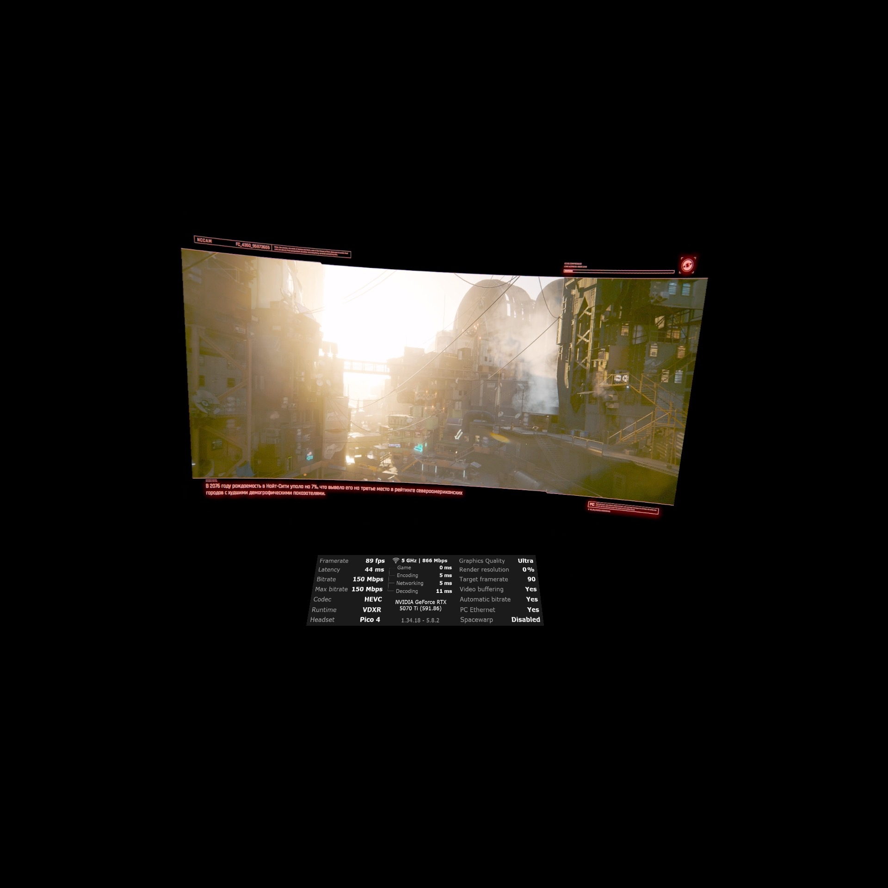

# CyberpunkVR Port

A 6-DoF **VR mod for Cyberpunk 2077**. An OpenXR `dxgi.dll` proxy injects head
tracking and stereo into REDengine, a RED4ext plugin drives a **full-body VR
avatar with motion-controlled hands**, and a set of CET / redscript mods add VR
weapon aiming, motion melee, hand-to-holster equipping, a VR-friendly HUD and
more. Everything is configured from an in-headset **F10** overlay.

Repository: <https://github.com/dariulone/cyberpunk-vr-port>

> ⚠️ Experimental community mod. Not affiliated with CD PROJEKT RED. Use at your
> own risk and keep backups of your saves.

## Features

- **OpenXR head tracking** injected into the REDengine render path, with runtime
  FOV-based projection and world-scale / IPD controls.
- **AER V2 reprojection** — per-eye / intermediate frames synthesised from the
  game's mono output via NVIDIA Optical Flow + a depth-aware warp (unified
  producer, late IPD). Automatic D3D12-compute fallback without CUDA.
- **Full-body VR avatar** (VRIK/FRIK) — body under the HMD, arm-length
  calibration, leg IK, real-life squat. Hands are 1:1 with the controllers.
- **Decoupled VR weapon aim** — bullets follow the real weapon muzzle, not the
  camera; optional barrel crosshair dot, scope-zoom aware.
- **VR motion melee** — real swings trigger the game's native melee along the
  blade (native damage/reaction/stamina).
- **Hand-to-holster** equip/unequip on a grip squeeze — *immersive* (by visual
  holster) or *simple* (fixed weapon slots).
- **VR controller mapping** merged into XInput: full-forward = sprint,
  full-down = crouch, snap or smooth turn, HMD/hand-relative locomotion.
- **VR HUD** with per-element placement & scale, **world-map head-lock**, CAS
  sharpening, and DLSS/NGX handling.
- **In-headset F10 overlay** with tabbed, live, persisted settings.
- SteamVR (OpenVR) runtime supported alongside OpenXR; pre-launch resolution
  selector; quiet-by-default logging with a verbose toggle.

See [`docs/`](docs/) for engineering notes (e.g. the stereo R&D writeup).

## Requirements

- **Cyberpunk 2077** (PC, current patch).
- An **OpenXR runtime** — e.g. Virtual Desktop / VDXR or SteamVR — started
  **before** the game.
- **RED4ext** — loads the native `CyberpunkVR_Hands.dll` plugin.
- **Cyber Engine Tweaks (CET)** — runs the `CyberpunkVRPort_*` Lua mods.
- **redscript** — compiles the `CyberpunkVRPort_*` `.reds` scripts.
- NVIDIA GPU recommended for the AER V2 NvOF path (otherwise the D3D12-compute
  fallback is used).

Install RED4ext, CET and redscript first (the usual Nexus dependencies).

## Installation (drop-in)

Download the release archive and extract its contents into your **Cyberpunk 2077
game root** (the folder that contains `bin\`, `r6\`, `red4ext\`). The files land
as:

```
bin\x64\dxgi.dll                                              # VR proxy (OpenXR + stereo + AER + F10 overlay)
red4ext\plugins\CyberpunkVR_Hands\CyberpunkVR_Hands.dll       # native plugin (avatar/hands, weapon aim, shared bridge)
bin\x64\plugins\cyber_engine_tweaks\mods\CyberpunkVRPort_*\   # CET mods: HUD, Holster, VRIK, Weapon, WorldMap
r6\scripts\CyberpunkVRPort_*\                                 # redscript: HUD, Holster, Melee, NoAnims, WeaponUp, WorldMap
```

Then **start your OpenXR runtime first**, and launch the game.

> Proxy-only install (camera/stereo, no avatar/weapons): just drop
> `bin\x64\dxgi.dll` next to `Cyberpunk2077.exe`. The avatar, weapon, holster,
> HUD and world-map features additionally need RED4ext + CET + redscript and the
> bundled mods above.


## Controls

VR controller input is merged into the native CP2077 gamepad, so the in-game
"Controller" key bindings apply. Default VR mapping:

| Input | Action |
|---|---|
| Left stick | Walk / strafe — **push fully forward = sprint** |
| Right stick X | Turn camera (snap or smooth) |
| Right stick **fully down** | **Crouch** (R3) |
| Right trigger / Left trigger | Fire / Aim |
| Right grip | Hand-to-holster equip / unequip; melee power modifier |
| Left grip | Crouch (shoulder) |
| A / B | Jump / Dodge |
| X / Y | Reload·interact / Weapon switch |
| Left thumb click / Right thumb click | Sprint (L3) / Crouch (R3) |
| Left menu button | Pause menu |
| Swing a melee weapon | VR motion melee (native attack along the blade) |

Buttons follow each runtime's interaction profile (Touch / Index / Vive / WMR);
customise the actual actions in the game's *Settings → Key Bindings → Controller*.

Hotkeys:

- `F7` — recenter HMD
- `F10` / `Insert` — open the in-headset settings overlay

## In-headset overlay (F10)

Tabbed, live, and saved to `vrport.ini`:

- **General** — FOV / world scale / IPD, AER & mono submit, pose pair-lock,
  motion prediction, sharpening, runtime selection.
- **Controller** — XInput merge, locomotion source (Game / HMD / Left / Right
  hand), snap turn + angle, HMD-only pitch, **Immersive holsters** toggle.
- **VRIK** — start/stop tracking, IK calibration (reach scale, height, elbow
  swing/pole, wrist offset), diagnostics.
- **HUD** — per-element X / Y / scale for every HUD group.

## Mod components

| Component | Type | Purpose |
|---|---|---|
| `dxgi.dll` | proxy DLL | OpenXR head tracking, stereo, AER V2 reprojection, F10 overlay, XInput merge |
| `CyberpunkVR_Hands.dll` | RED4ext plugin | Full-body avatar / hand IK, weapon-aim orientation override, shared-memory bridge |
| `CyberpunkVRPort_VRIK` | CET | Starts hand tracking, bridges calibration |
| `CyberpunkVRPort_Weapon` | CET | Decoupled weapon aim + VR motion-melee detection |
| `CyberpunkVRPort_Holster` | CET + reds | Hand-to-holster equip/unequip (immersive / simple) |
| `CyberpunkVRPort_HUD` | CET + reds | VR HUD layout |
| `CyberpunkVRPort_WorldMap` | CET + reds | World-map head-lock |
| `CyberpunkVRPort_Melee` | reds | Native melee along the blade segment |
| `CyberpunkVRPort_WeaponUp` | reds | Stops auto-lower / auto-unequip of drawn weapons |
| `CyberpunkVRPort_NoAnims` | reds | Disables VR-fighting animations (keeps gameplay systems) |

## Logs

- `Cyberpunk 2077\bin\x64\cyberpunkvrport.log` — main proxy log (quiet by
  default; enable **F10 → verbose log** for deep per-frame diagnostics).
- Per-mod CET logs live in each mod folder. Preferred file for bug reports is the
  main proxy log.

## Media

[](https://www.youtube.com/shorts/Q_nt0dceXNU)
[](https://www.youtube.com/shorts/CXeYW1_FTWE)




*Photos taken through PICO 4 lenses with an iPhone 13 Pro Max.*


*Valve Index (canted-display OpenXR) shots courtesy of [Boe6Eod7Nty](https://github.com/Boe6Eod7Nty).*

## Test hardware used during development

- Headset: PICO 4 (via VDXR)
- CPU: AMD Ryzen 7 5800X
- GPU: NVIDIA RTX 5070 Ti
- RAM: 32 GB DDR4
- OS: Windows 11 Pro 25H2 (26200)

## Credits & license

Created by [dariulone](https://github.com/dariulone), Valve Index testing by
[Boe6Eod7Nty](https://github.com/Boe6Eod7Nty). Built on OpenXR, Dear ImGui,
RED4ext, Cyber Engine Tweaks, redscript and the NVIDIA Optical Flow SDK. See
[`LICENSE`](LICENSE).
